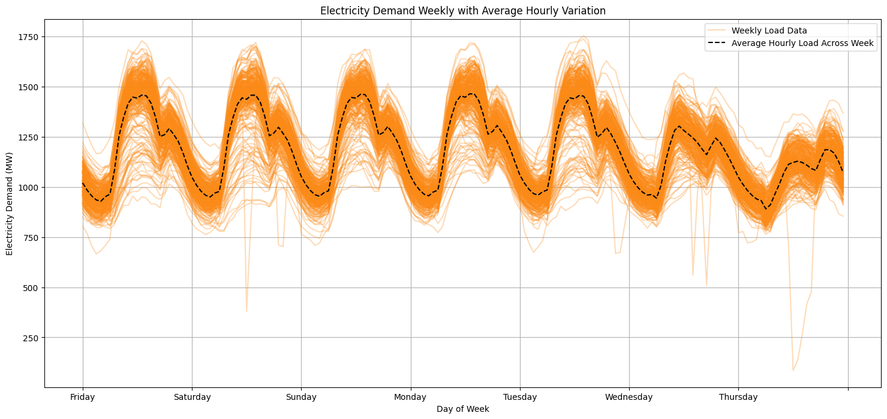

# Electricity Demand Prediction with BiLSTM-attention
Predict electricity nat demand with 2015-2020 data using BiLSTM-attention

# EDA
# Read Data
```python
df_train = pd.read_csv('/Users/Fikry/datasets/load_kaggle/continuous dataset.csv' ,index_col=[0],parse_dates=[0])
df_train

datetime  nat_demand	T2M_toc	QV2M_toc	TQL_toc	W2M_toc	T2M_san	QV2M_san	TQL_san	W2M_san	T2M_dav	QV2M_dav	TQL_dav	W2M_dav	Holiday_ID	holiday	school
																
2015-01-03 01:00:00	970.3450	25.865259	0.018576	0.016174	21.850546	23.482446	0.017272	0.001855	10.328949	22.662134	0.016562	0.096100	5.364148	0	0	0
2015-01-03 02:00:00	912.1755	25.899255	0.018653	0.016418	22.166944	23.399255	0.017265	0.001327	10.681517	22.578943	0.016509	0.087646	5.572471	0	0	0
2015-01-03 03:00:00	900.2688	25.937280	0.018768	0.015480	22.454911	23.343530	0.017211	0.001428	10.874924	22.531030	0.016479	0.078735	5.871184	0	0	0
2015-01-03 04:00:00	889.9538	25.957544	0.018890	0.016273	22.110481	23.238794	0.017128	0.002599	10.518620	22.512231	0.016487	0.068390	5.883621	0	0	0
2015-01-03 05:00:00	893.6865	25.973840	0.018981	0.017281	21.186089	23.075403	0.017059	0.001729	9.733589	22.481653	0.016456	0.064362	5.611724	0	0	0
...	...	...	...	...	...	...	...	...	...	...	...	...	...	...	...	...
2020-06-26 20:00:00	1128.5592	27.246545	0.020303	0.055511	9.289304	25.715295	0.019746	0.121552	1.990773	23.746545	0.018381	0.150879	2.444658	0	0	1
2020-06-26 21:00:00	1112.7488	27.099573	0.020395	0.053848	9.837504	25.552698	0.019632	0.153870	2.094459	23.693323	0.018320	0.156311	2.515814	0	0	1
2020-06-26 22:00:00	1081.5680	26.971155	0.020448	0.057251	10.262464	25.393030	0.019518	0.144531	2.396369	23.658655	0.018327	0.153259	2.800717	0	0	1
2020-06-26 23:00:00	1041.6240	26.867487	0.020464	0.064178	10.326567	25.258112	0.019403	0.108063	2.720871	23.601862	0.018358	0.152771	3.138132	0	0	1
2020-06-27 00:00:00	1013.5683	26.750330	0.020441	0.063965	10.198346	25.125330	0.019281	0.100189	2.785751	23.562830	0.018404	0.162598	3.286878	0	0	1
48048 rows × 16 columns
```

# Check Null Data
```python
df_train.isna().sum()
```
# Check Duplicated Data
```python
df_train.duplicated().sum()
```

# Check Highest and Lowest National Electricity Demand
```python
np.nanmax(df_train["nat_demand"])
1754.882 2020-01-17 14:00:00
np.nanmin(df_train["nat_demand"])
85.19250000000002 2019-01-20 12:00:00
```

# Check Years Available
```python
years = df_train.index.year.unique().tolist()
print(years)
[2015, 2016, 2017, 2018, 2019, 2020]
```

# Plot Electricity Demand 2015-2020

# Plot Temperature in Every City
Tocumen City


Santiago City


David City

# Electricity and Temperature
Electricity and Temperature Tocumen City


Electricity and Temperature Santiago City


Electricity and Temperature David City


# Average Hourly Electricity Demand

# Daily Variation


# Weekly Variation
Dataset start from Friday

# Preprocessing Data
Split data into Train, Test, and Validation with Ratio 8:1:1
```python
from sklearn.preprocessing import MinMaxScaler
features = df_train[['QV2M_toc', 'TQL_toc', 'W2M_toc', 'QV2M_san', 'TQL_san', 'W2M_san', 'QV2M_dav', 'TQL_dav', 'W2M_dav','T2M_toc', 'T2M_san', 'T2M_dav']]
labels = df_train['nat_demand']
scaler = MinMaxScaler()
features_scaled = scaler.fit_transform(features)

X = features_scaled.reshape(features_scaled.shape[0], 1, features_scaled.shape[1])
y = labels.values

X_train, X_temp, y_train, y_temp = train_test_split(X, y, test_size=0.2, random_state=42)
X_val, X_test, y_val, y_test = train_test_split(X_temp, y_temp, test_size=0.5, random_state=42)
```
Training sequences shape: (38438, 1, 12), Target shape: (38438,)

Testing sequences shape: (4805, 1, 12), Target shape: (4805,)

Validation sequences shape: (4805, 1, 12), Target shape: (4805, 1, 12)

# Train Data with BiLSTM-attention
Define Model
```python
import os
import random
def model_BiLSTM_attention(train_data, target_train, X_val, y_val, Nepochs):
    seed_value = 110
    os.environ['PYTHONHASHSEED'] = str(seed_value)
    random.seed(seed_value)
    np.random.seed(seed_value)
    tf.random.set_seed(seed_value)
    
    input_shape = (train_data.shape[1], train_data.shape[2])
    inputs = Input(shape=input_shape)
    
    x = Bidirectional(LSTM(89, return_sequences=True))(inputs)
    x = Dropout(0.4)(x)
    
    x = Bidirectional(LSTM(units=16, return_sequences=True))(x)
    x = Bidirectional(LSTM(units=8, recurrent_activation='sigmoid', return_sequences=True))(x)
    
    attention_output = Attention()([x, x])
    
    x = Concatenate()([x, attention_output])
    outputs = LSTM(units=1, activation='relu')(x)

    model = tf.keras.models.Model(inputs=inputs, outputs=outputs)
    optimizer = tf.keras.optimizers.Adam(0.0024021)
    model.compile(loss=tf.keras.losses.Huber(delta=1.0), optimizer=optimizer, metrics=['mse'])

    callback = [tf.keras.callbacks.EarlyStopping(monitor='val_loss', patience=5)]
    modelhist = model.fit(train_data, target_train, epochs=Nepochs, shuffle=True,
                          batch_size=16, validation_data=(X_val, y_val), callbacks=callback)
    
    model.summary()
    return model, modelhist
```

Call Model with 1000 Epoch
```python
Nepochs = 1000
model, modelhist = model_BiLSTM_attention(X_train, y_train, X_val, y_val, Nepochs)
```

Train loss and Validation loss

# Predict Results Electricity Demand
```python
predictions = model.predict(X_test)
```

Plot actual vs predicted


# Evaluate Model
```python
from sklearn.metrics import mean_squared_error, mean_absolute_error, r2_score
from numpy import cov, array

predictions = predictions.flatten() 
def calculate_metrics(y_true, y_pred):
    # R² (Coefficient of Determination)
    r2 = r2_score(y_true, y_pred)

    # RMSE (Root Mean Squared Error)
    rmse = np.sqrt(mean_squared_error(y_true, y_pred))

    # MAPE (Mean Absolute Percentage Error)
    mape = np.mean(np.abs((y_true - y_pred) / y_true)) * 100

    # CC (Correlation Coefficient)
    cc = np.corrcoef(y_true, y_pred)[0, 1]

    return r2, rmse, mape, cc

r2, rmse, mape, cc = calculate_metrics(y_test, predictions)
```
R²: 0.5557

RMSE: 126.5736

MAPE: 8.5007%

Correlation Coefficient (CC): 0.7553

# Predict with BiLSTM
BiLSTM Model
```python
def model_BiLSTM(train_data, target_train, X_val, y_val, Nepochs):
    seed_value = 110
    os.environ['PYTHONHASHSEED'] = str(seed_value)
    random.seed(seed_value)
    np.random.seed(seed_value)
    tf.random.set_seed(seed_value)
    
    input_shape = (train_data.shape[1], train_data.shape[2])
    inputs = Input(shape=input_shape)
    
    x = Bidirectional(LSTM(89, return_sequences=True))(inputs)
    x = Dropout(0.4)(x)
    
    x = Bidirectional(LSTM(units=16, return_sequences=True))(x)
    x = Bidirectional(LSTM(units=8, recurrent_activation='sigmoid', return_sequences=True))(x)

    outputs = LSTM(units=1, activation='relu')(x)

    model = tf.keras.models.Model(inputs=inputs, outputs=outputs)
    optimizer = tf.keras.optimizers.Adam(1e-3)
    model.compile(loss=tf.keras.losses.Huber(delta=1.0), optimizer=optimizer, metrics=['mse'])

    callback = [tf.keras.callbacks.EarlyStopping(monitor='val_loss', patience=5)]
    modelhist = model.fit(train_data, target_train, epochs=Nepochs, shuffle=True,
                          batch_size=16, validation_data=(X_val, y_val), callbacks=callback)
    
    model.summary()
    return model, modelhist
```
```python
Nepochs = 1000
model, modelhist = model_BiLSTM(X_train, y_train, X_val, y_val, Nepochs)
```
# Predict Results BiLSTM


# Evaluate
R²: 0.5442

RMSE: 128.2026

MAPE: 8.5298%

Correlation Coefficient (CC): 0.7511

# Conclusion
Overall, while both the BiLSTM and BiLSTM with Attention models provide reasonable predictive power, the performance metrics suggest that adding the attention mechanism has not significantly improved the results in this case. Further refinement, such as additional feature engineering, or model tuning, might help to enhance model performance. Both model can't capture some largest fluence electricity effectively.
